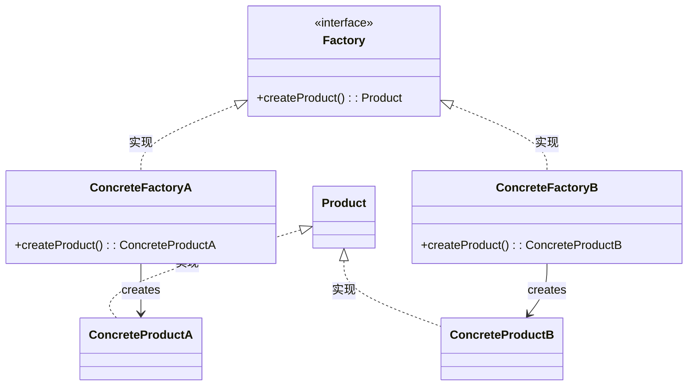

# 工厂方法模式

简单工厂模式  + “开闭原则” =    工厂方法模式




优点：

- 每个具体工厂类只负责创建对应的产品，降低了工厂类的职责
- 增加新的产品类不需要修改工厂类的代码，符合开闭原则

缺点：

- 系统中需要有多个具体工厂类，增加了代码复杂度
- 使用不当可能会造成工厂类数量膨胀，降低代码可读性

```go
package main

import (
    "fmt"
)
// 抽象产品接口
type Product interface {
    GetName() string
}
// 具体产品1
type Product1 struct {
    Name string
}
func (p *Product1) GetName() string {
    return p.Name
}
// 具体产品2
type Product2 struct {
    Name string
}
func (p *Product2) GetName() string {
    return p.Name
}
// 抽象工厂接口
type Factory interface {
    CreateProduct() Product
}
// 具体工厂1
type Factory1 struct{}
func (f *Factory1) CreateProduct() Product {
    return &Product1{Name: "Product1"}
}
// 具体工厂2
type Factory2 struct{}
func (f *Factory2) CreateProduct() Product {
    return &Product2{Name: "Product2"}
}
func main() {
    factory1 := &Factory1{}
    factory2 := &Factory2{}
    product1 := factory1.CreateProduct()
    product2 := factory2.CreateProduct()
    fmt.Println(product1.GetName())
    fmt.Println(product2.GetName())
}
```

