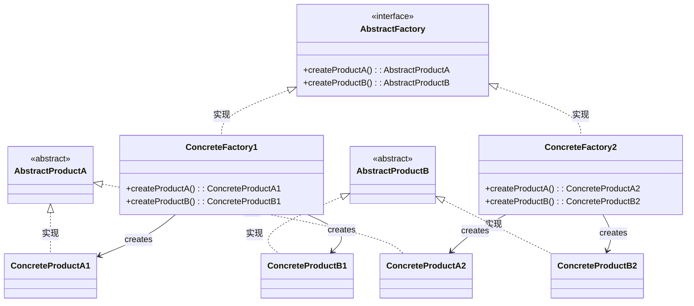

# 抽象工厂方法模式



优点：

- 在系统中可以有多个具体工厂，每个具体工厂可以生产多种具体产品
- 增加新的产品类不需要修改工厂类的代码，符合开闭原则

缺点：

- 代码结构复杂，增加了系统的复杂度
- 增加新的产品类需要对工厂类进行修改，违反了开闭原则

```go
package main

import (
    "fmt"
)

// 抽象产品接口1
type Product1 interface {
    GetName1() string
}
// 抽象产品接口2
type Product2 interface {
    GetName2() string
}


// 具体产品1
type ConcreteProduct1 struct {
    Name string
}

// 具体产品2
type ConcreteProduct2 struct {
    Name string
}
func (p *ConcreteProduct1) GetName1() string {
    return p.Name
}

func (p *ConcreteProduct2) GetName2() string {
    return p.Name
}

// 抽象工厂接口
type Factory interface {
    CreateProduct1() Product1
    CreateProduct2() Product2
}

// 具体工厂
type ConcreteFactory struct{}

func (f *ConcreteFactory) CreateProduct1() Product1 {
    return &ConcreteProduct1{Name: "ConcreteProduct1"}
}

func (f *ConcreteFactory) CreateProduct2() Product2 {
    return &ConcreteProduct2{Name: "ConcreteProduct2"}
}
func main() {
    factory := &ConcreteFactory{}
    product1 := factory.CreateProduct1()
    product2 := factory.CreateProduct2()
    fmt.Println(product1.GetName1())
    fmt.Println(product2.GetName2())
}

```

