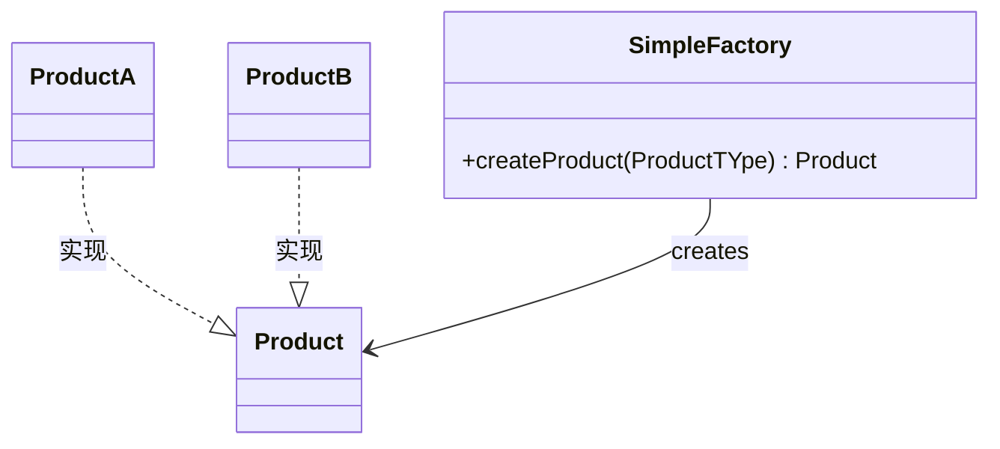

# 简单工厂模式

1. **工厂（Factory）角色**：简单工厂模式的核心，负责实现创建所有实例的内部逻辑,可以被外界直接调用，创建所需的产品对象。
2. **抽象产品（Abstract Product）角色**：简单工厂模式所创建的所有对象的父类，它负责描述所有实例所共有的公共接口。
3. **具体产品（Concrete Product）角色**：简单工厂模式所创建的具体实例对象            





```go
package main
import (
    "fmt"
)
// 抽象产品接口
type Product interface {
    GetName() string
}
// 具体产品1
type Product1 struct {
    Name string
}
func (p *Product1) GetName() string {
    return p.Name
}
// 具体产品2
type Product2 struct {
    Name string
}
func (p *Product2) GetName() string {
    return p.Name
}
// 简单工厂
type SimpleFactory struct{}
func (sf *SimpleFactory) CreateProduct(t int) Product {
    switch t {
    case 1:
        return &Product1{Name: "Product1"}
    case 2:
        return &Product2{Name: "Product2"}
    default:
        return nil
    }
}
func main() {
    factory := &SimpleFactory{}
    product1 := factory.CreateProduct(1)
    product2 := factory.CreateProduct(2)
    fmt.Println(product1.GetName())
    fmt.Println(product2.GetName())
}
```

优点：

- 实现了对象创建和使用的分离，解决了类的实例化问题
- 可以避免客户端直接创建对象，减少系统的耦合性

缺点：

- 如果添加新的产品需要修改工厂类的代码，不符合开闭原则
- 工厂类的职责过重，一旦出现问题，整个系统都会受影响
- 增加新的产品类需要对工厂类进行修改，在产品类数目较多时不太实际

