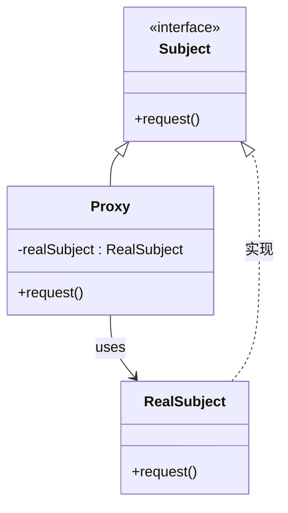

# 代理模式

优点：

(1) 能够协调调用者和被调用者，在一定程度上降低了系统的耦合度。

(2) 客户端可以针对抽象主题角色进行编程，增加和更换代理类无须修改源代码，符合开闭原则，系统具有较好的灵活性和可扩展性。

缺点：

(1) 代理实现较为复杂。




```go
package main

import (
	"fmt"
)

// Subject 是一个表示我们想要代理的对象的接口。
type Subject interface {
	Do() string
}

// ConcreteSubject 是Subject接口的具体实现。
type ConcreteSubject struct {}

func (c *ConcreteSubject) Do() string {
	return "ConcreteSubject"
}

// Proxy 是一个作为Subject的代理结构体。
type Proxy struct {
	subject Subject
}

func (p *Proxy) Do() string {
	if p.subject == nil {
		p.subject = &ConcreteSubject{}
	}
	return p.subject.Do()
}

func main() {
	proxy := &Proxy{}
	fmt.Println(proxy.Do())
}

```

