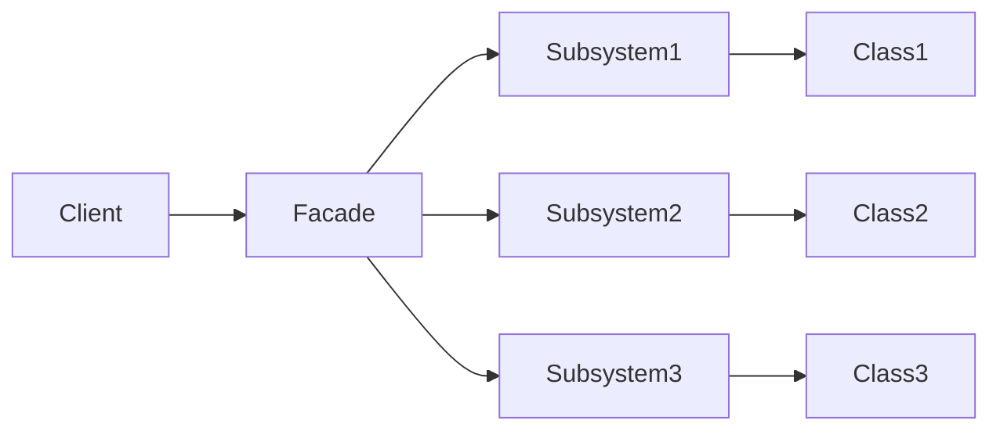

# 外观模式

优点：

(1) 它对客户端屏蔽了子系统组件，减少了客户端所需处理的对象数目，并使得子系统使用起来更加容易。通过引入外观模式，客户端代码将变得很简单，与之关联的对象也很少。

(2) 它实现了子系统与客户端之间的松耦合关系，这使得子系统的变化不会影响到调用它的客户端，只需要调整外观类即可。

(3) 一个子系统的修改对其他子系统没有任何影响。

缺点：

(1) 不能很好地限制客户端直接使用子系统类，如果对客户端访问子系统类做太多的限制则减少了可变性和灵活 性。

(2) 如果设计不当，增加新的子系统可能需要修改外观类的源代码，违背了开闭原则。




```go
package main

import "fmt"

// Subsystem1 类
type Subsystem1 struct{}

func (s *Subsystem1) Method1() {
	fmt.Println("Subsystem1 Method1")
}

// Subsystem2 类
type Subsystem2 struct{}

func (s *Subsystem2) Method2() {
	fmt.Println("Subsystem2 Method2")
}

// Facade 类
type Facade struct {
	subsystem1 *Subsystem1
	subsystem2 *Subsystem2
}

func (f *Facade) Method() {
	f.subsystem1.Method1()
	f.subsystem2.Method2()
}

func NewFacade() *Facade {
	return &Facade{
		subsystem1: &Subsystem1{},
		subsystem2: &Subsystem2{},
	}
}

func main() {
	facade := NewFacade()
	facade.Method()
}

```

