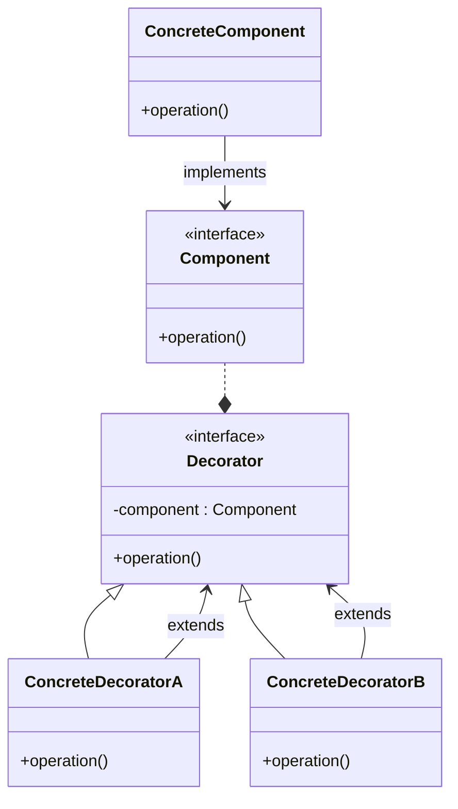

# 装饰模式

优点：

(1) 对于扩展一个对象的功能，装饰模式比继承更加灵活性，不会导致类的个数急剧增加。

(2) 可以通过一种动态的方式来扩展一个对象的功能，从而实现不同的行为。

(3) 可以对一个对象进行多次装饰。

(4) 具体构件类与具体装饰类可以独立变化，用户可以根据需要增加新的具体构件类和具体装饰类，原有类库代码无须改变，符合“开闭原则”。

缺点：

(1) 使用装饰模式进行系统设计时将产生很多小对象，大量小对象的产生势必会占用更多的系统资源，影响程序的性能。

(2) 装饰模式提供了一种比继承更加灵活机动的解决方案，但同时也意味着比继承更加易于出错，排错也很困难，对于多次装饰的对象，调试时寻找错误可能需要逐级排查，较为繁琐。





```go
package main

import (
	"fmt"
)
// Component is the interface that all components should implement.
type Component interface {
	Do() string
}
// ConcreteComponent is a concrete implementation of the Component interface.
type ConcreteComponent struct {}

func (c *ConcreteComponent) Do() string {
	return "ConcreteComponent"
}
// Decorator is an abstract implementation of the Component interface.
// It acts as a wrapper for concrete components.
type Decorator struct {
	Component Component
}
func (d *Decorator) Do() string {
	return d.Component.Do()
}
// ConcreteDecoratorA is a concrete implementation of the Decorator.
type ConcreteDecoratorA struct {
	Decorator
}

func (c *ConcreteDecoratorA) Do() string {
	return fmt.Sprintf("ConcreteDecoratorA (%s)", c.Decorator.Do())
}
// ConcreteDecoratorB is a concrete implementation of the Decorator.
type ConcreteDecoratorB struct {
	Decorator
}
func (c *ConcreteDecoratorB) Do() string {
	return fmt.Sprintf("ConcreteDecoratorB (%s)", c.Decorator.Do())
}
func main() {
	component := &ConcreteComponent{}
	decoratorA := &ConcreteDecoratorA{Decorator{component}}
	decoratorB := &ConcreteDecoratorB{Decorator{decoratorA}}
	fmt.Println(decoratorB.Do())
}

```

