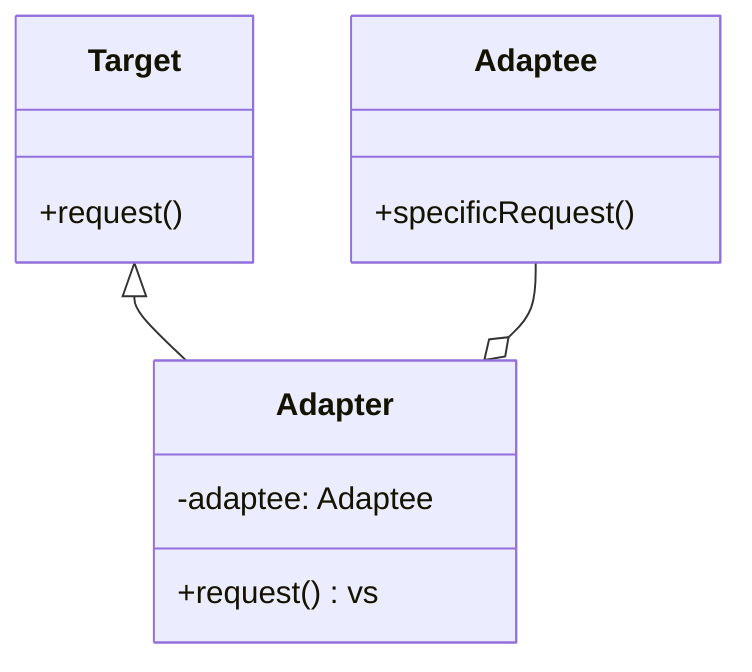

# 适配器模式

**Target（目标抽象类）：**目标抽象类定义客户所需接口，可以是一个抽象类或接口，也可以是具体类。

**Adapter（适配器类）：**适配器可以调用另一个接口，作为一个转换器，对Adaptee和Target进行适配，适配器类是适配器模式的核心，在对象适配器中，它通过继承Target并关联一个Adaptee对象使二者产生联系。

**Adaptee（适配者类）：**适配者即被适配的角色，它定义了一个已经存在的接口，这个接口需要适配，适配者类一般是一个具体类，包含了客户希望使用的业务方法，在某些情况下可能没有适配者类的源代码。

优点：

(1) 将目标类和适配者类解耦，通过引入一个适配器类来重用现有的适配者类，无须修改原有结构。

(2) 增加了类的透明性和复用性，将具体的业务实现过程封装在适配者类中，对于客户端类而言是透明的，而且提高了适配者的复用性，同一个适配者类可以在多个不同的系统中复用。

(3) 灵活性和扩展性都非常好，可以很方便地更换适配器，也可以在不修改原有代码的基础上增加新的适配器类，完全符合“开闭原则”。

缺点:

适配器中置换适配者类的某些方法比较麻烦。



```go
package main

import "fmt"

// 目标接口
type Target interface {
	Request() string
}

// 被适配的类
type Adaptee struct{}

func (a *Adaptee) SpecificRequest() string {
	return "220V交流电"
}

// 适配器类
type Adapter struct {
	adaptee *Adaptee
}

func (a *Adapter) Request() string {
	return fmt.Sprintf("适配后的结果: %s", a.adaptee.SpecificRequest())
}

func main() {
	adaptee := &Adaptee{}
	adapter := &Adapter{adaptee: adaptee}
	fmt.Println(adapter.Request())
}

```

`Adaptee` 结构体代表被适配的类，提供了 `SpecificRequest` 方法。`Adapter` 结构体实现了目标接口 `Target`，通过内部包含一个 `Adaptee` 的实例来调用 `SpecificRequest` 方法，并通过 `Request` 方法提供给外界。这样，适配器就实现了将 `Adaptee` 的接口适配成为目标接口的作用。
