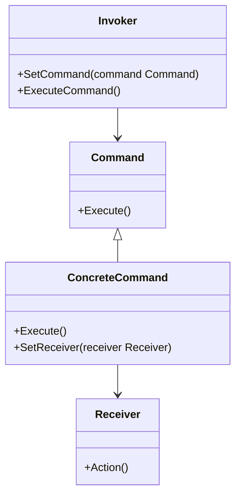

# 命令模式

优点：

(1) 降低系统的耦合度。由于请求者与接收者之间不存在直接引用，因此请求者与接收者之间实现完全解耦，相同的请求者可以对应不同的接收者，同样，相同的接收者也可以供不同的请求者使用，两者之间具有良好的独立性。

(2) 新的命令可以很容易地加入到系统中。由于增加新的具体命令类不会影响到其他类，因此增加新的具体命令类很容易，无须修改原有系统源代码，甚至客户类代码，满足“开闭原则”的要求。

(3) 可以比较容易地设计一个命令队列或宏命令（组合命令）。

缺点：

使用命令模式可能会导致某些系统有过多的具体命令类。因为针对每一个对请求接收者的调用操作都需要设计一个具体命令类，因此在某些系统中可能需要提供大量的具体命令类，这将影响命令模式的使用。




```go
type Command interface {
	Execute()
}

type LightOnCommand struct {
	light *Light
}

func (l *LightOnCommand) Execute() {
	l.light.On()
}

type LightOffCommand struct {
	light *Light
}

func (l *LightOffCommand) Execute() {
	l.light.Off()
}

type Light struct {
	state bool
}

func (l *Light) On() {
	fmt.Println("Light turned on.")
	l.state = true
}

func (l *Light) Off() {
	fmt.Println("Light turned off.")
	l.state = false
}

type RemoteControl struct {
	onCommand  Command
	offCommand Command
}

func (r *RemoteControl) SetCommand(on, off Command) {
	r.onCommand = on
	r.offCommand = off
}

func (r *RemoteControl) PressOnButton() {
	r.onCommand.Execute()
}

func (r *RemoteControl) PressOffButton() {
	r.offCommand.Execute()
}

func main() {
	light := Light{}
	lightOn := LightOnCommand{light: &light}
	lightOff := LightOffCommand{light: &light}

	remote := RemoteControl{}
	remote.SetCommand(lightOn, lightOff)

	remote.PressOnButton()
	remote.PressOffButton()
}

```

定义了一个命令接口`Command`，该接口定义了一个`Execute`方法。

然后定义了两个结构体`LightOnCommand`和`LightOffCommand`，它们都实现了接口`Command`的`Execute`方法，并存储了一个`Light`类型的指示。

接下来，定义了一个`Light`结构体，存储了灯的状态，并定义了两个方法`On`和`Off`，用于打开和关闭灯。

最后，定义了一个`RemoteControl`结构体，它存储了两个命令：打开命令和关闭命令。此外，它还定义了两个方法：`SetCommand`方法，用于设置命令；和`PressOnButton`和`PressOffButton`方法，用于执行命令。

在主函数中，创建了一个`Light`对象，两个命令对象`LightOnCommand`和`LightOffCommand`，并创建了一个`RemoteControl`对象，并将命令分配给遥控器。

最后，通过调用`PressOnButton`和`PressOffButton`方法，模拟用户操作，以查看命令是否已正确执行。
