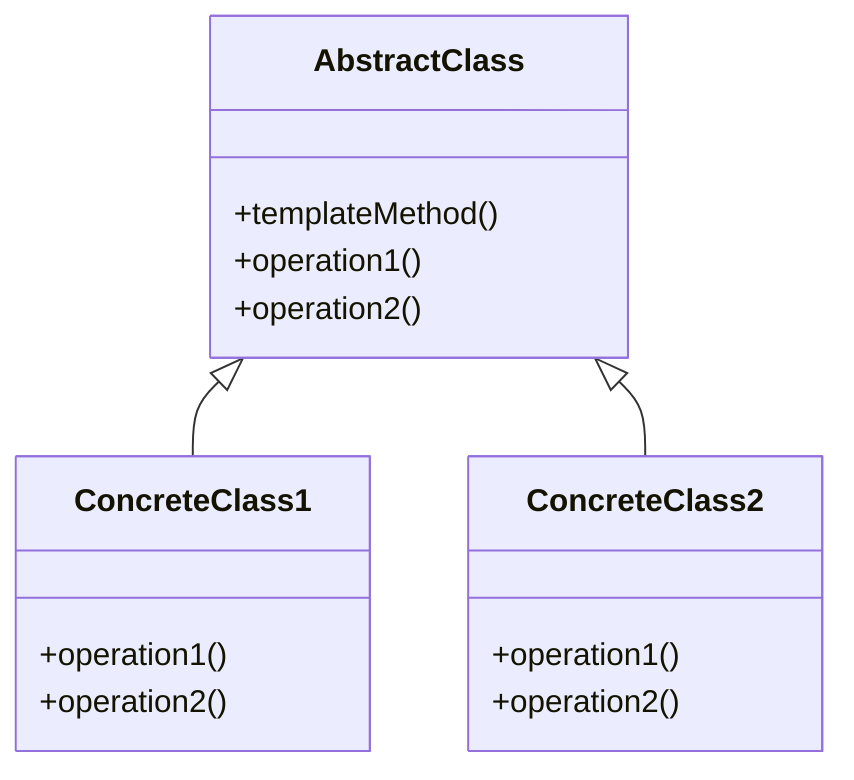

# 模板方法模式

**AbstractClass（抽象类）：**在抽象类中定义了一系列基本操作(PrimitiveOperations)，这些基本操作可以是具体的，也可以是抽象的，每一个基本操作对应算法的一个步骤，在其子类中可以重定义或实现这些步骤。同时，在抽象类中实现了一个模板方法(Template Method)，用于定义一个算法的框架，模板方法不仅可以调用在抽象类中实现的基本方法，也可以调用在抽象类的子类中实现的基本方法，还可以调用其他对象中的方法。

**ConcreteClass（具体子类）：**它是抽象类的子类，用于实现在父类中声明的抽象基本操作以完成子类特定算法的步骤，也可以覆盖在父类中已经实现的具体基本操作。

优点：

(1) 在父类中形式化地定义一个算法，而由它的子类来实现细节的处理，在子类实现详细的处理算法时并不会改变算法中步骤的执行次序。

(2) 模板方法模式是一种代码复用技术，它在类库设计中尤为重要，它提取了类库中的公共行为，将公共行为放在父类中，而通过其子类来实现不同的行为，它鼓励我们恰当使用继承来实现代码复用。

(3) 可实现一种反向控制结构，通过子类覆盖父类的钩子方法来决定某一特定步骤是否需要执行。

(4) 在模板方法模式中可以通过子类来覆盖父类的基本方法，不同的子类可以提供基本方法的不同实现，更换和增加新的子类很方便，符合单一职责原则和开闭原则。


缺点：

需要为每一个基本方法的不同实现提供一个子类，如果父类中可变的基本方法太多，将会导致类的个数增加，系统更加庞大，设计也更加抽象。



```go
type Game interface {
	Initialize()
	StartPlay()
	EndPlay()
}

type Cricket struct{}

func (c Cricket) Initialize() {
	fmt.Println("Cricket Game Initialized! Start playing.")
}

func (c Cricket) StartPlay() {
	fmt.Println("Cricket Game Started. Enjoy the game!")
}

func (c Cricket) EndPlay() {
	fmt.Println("Cricket Game Finished!")
}

type Football struct{}

func (f Football) Initialize() {
	fmt.Println("Football Game Initialized! Start playing.")
}

func (f Football) StartPlay() {
	fmt.Println("Football Game Started. Enjoy the game!")
}

func (f Football) EndPlay() {
	fmt.Println("Football Game Finished!")
}

func PlayGame(game Game) {
	game.Initialize()
	game.StartPlay()
	game.EndPlay()
}

func main() {
	cricket := Cricket{}
	football := Football{}

	PlayGame(cricket)
	PlayGame(football)
}

```

此代码定义了一个接口`Game`，该接口定义了三个方法：`Initialize`，`StartPlay`和`EndPlay`。

然后定义了两个结构体`Cricket`和`Football`，它们都实现了接口`Game`的所有方法。

最后定义了一个名为`PlayGame`的函数，该函数接收一个`Game`类型的参数，并通过调用它的三个方法来执行模板方法。

在`main`函数中，我们创建了一个`Cricket`结构体和一个`Football`结构体的实例，并将它们作为参数传递给`PlayGame`函数。