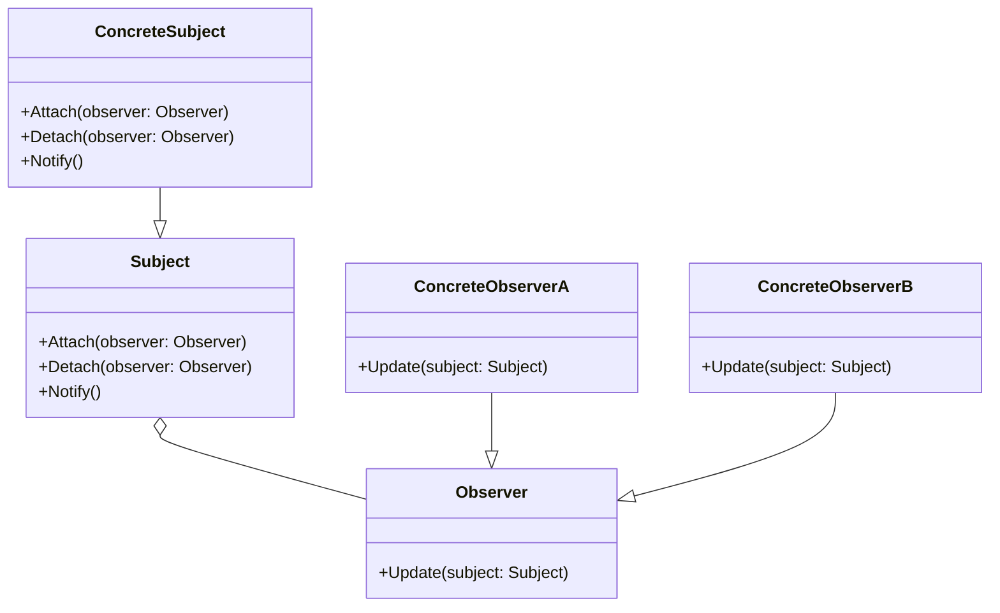

# 观察者模式

**Subject（被观察者或目标，抽象主题）：**被观察的对象。当需要被观察的状态发生变化时，需要通知队列中所有观察者对象。Subject需要维持（添加，删除，通知）一个观察者对象的队列列表。

**ConcreteSubject（具体被观察者或目标，具体主题）：**被观察者的具体实现。包含一些基本的属性状态及其他操作。

**Observer（观察者）：**接口或抽象类。当Subject的状态发生变化时，Observer对象将通过一个callback函数得到通知。

**ConcreteObserver（具体观察者）：**观察者的具体实现。得到通知后将完成一些具体的业务逻辑处理。

优点：

(1) 观察者模式可以实现表示层和数据逻辑层的分离，定义了稳定的消息更新传递机制，并抽象了更新接口，使得可以有各种各样不同的表示层充当具体观察者角色。

(2) 观察者模式在观察目标和观察者之间建立一个抽象的耦合。观察目标只需要维持一个抽象观察者的集合，无须了解其具体观察者。由于观察目标和观察者没有紧密地耦合在一起，因此它们可以属于不同的抽象化层次。

(3) 观察者模式支持广播通信，观察目标会向所有已注册的观察者对象发送通知，简化了一对多系统设计的难度。

(4) 观察者模式满足“开闭原则”的要求，增加新的具体观察者无须修改原有系统代码，在具体观察者与观察目标之间不存在关联关系的情况下，增加新的观察目标也很方便。

缺点：

(1) 如果一个观察目标对象有很多直接和间接观察者，将所有的观察者都通知到会花费很多时间。

(2) 如果在观察者和观察目标之间存在循环依赖，观察目标会触发它们之间进行循环调用，可能导致系统崩溃。

(3) 观察者模式没有相应的机制让观察者知道所观察的目标对象是怎么发生变化的，而仅仅只是知道观察目标发生了变化。




```go
package main

import "fmt"

// 定义主题接口
type Subject interface {
	Attach(observer Observer)
	Detach(observer Observer)
	Notify()
}

// 定义观察者接口
type Observer interface {
	Update(subject Subject)
}

// 具体主题类
type ConcreteSubject struct {
	observers []Observer
}

func (cs *ConcreteSubject) Attach(observer Observer) {
	cs.observers = append(cs.observers, observer)
}

func (cs *ConcreteSubject) Detach(observer Observer) {
	for i, o := range cs.observers {
		if o == observer {
			cs.observers = append(cs.observers[:i], cs.observers[i+1:]...)
			break
		}
	}
}

func (cs ConcreteSubject) Notify() {
	for _, observer := range cs.observers {
		observer.Update(cs)
	}
}

// 具体观察者类A
type ConcreteObserverA struct{}

func (coa ConcreteObserverA) Update(subject Subject) {
	fmt.Println("ConcreteObserverA received update")
}

// 具体观察者类B
type ConcreteObserverB struct{}

func (cob ConcreteObserverB) Update(subject Subject) {
	fmt.Println("ConcreteObserverB received update")
}

func main() {
	subject := ConcreteSubject{}
	observerA := ConcreteObserverA{}
	observerB := ConcreteObserverB{}

	subject.Attach(observerA)
	subject.Attach(observerB)

	subject.Notify()
}

```

